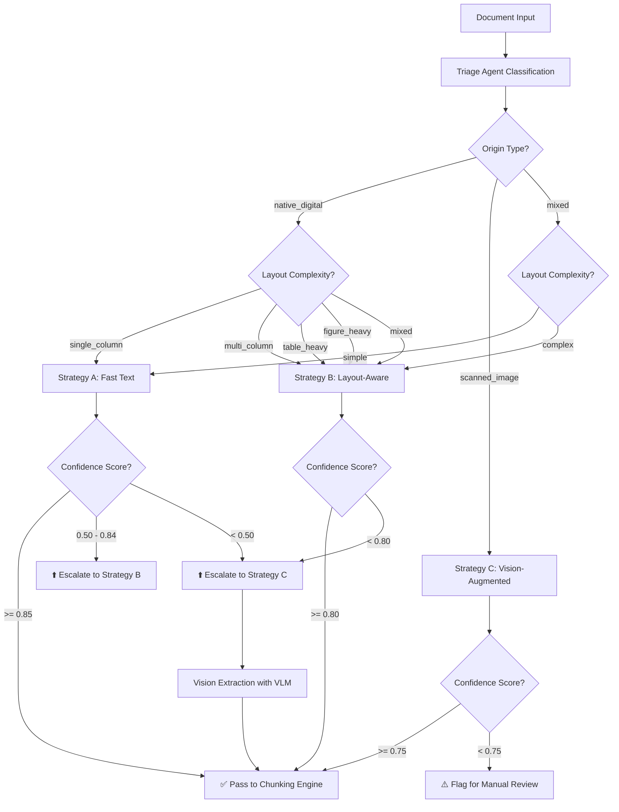
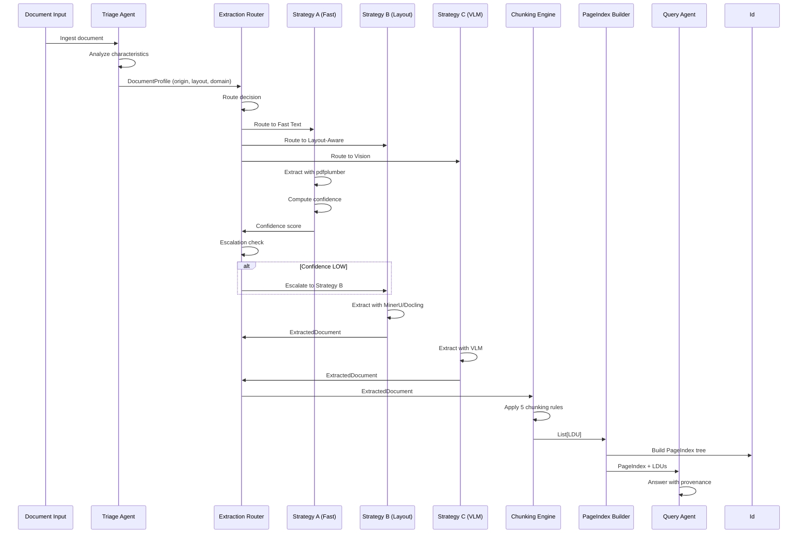

# DOMAIN_NOTES.md - Document Intelligence Refinery

> **Phase 0 Deliverable** | Document Science Primer & Domain Understanding
>
> This document captures the foundational domain knowledge required to architect the Document Intelligence Refinery. It represents the understanding an FDE must possess before writing any code.

---

## 1. Extraction Strategy Decision Tree

### Overview

The Document Intelligence Refinery employs a **tiered extraction strategy** that balances cost, quality, and processing time. The choice of extraction strategy is determined by document characteristics identified during the Triage stage.

### The Three Extraction Strategies

| Strategy | Tool | Cost | Use Case |
|----------|------|------|----------|
| **Strategy A (Fast Text)** | pdfplumber / pymupdf | Low | Native digital PDFs with simple layouts |
| **Strategy B (Layout-Aware)** | MinerU / Docling | Medium | Multi-column, table-heavy, mixed origin documents |
| **Strategy C (Vision-Augmented)** | VLMs (GPT-4o / Gemini) | High | Scanned images, handwriting, low confidence scenarios |

---

### Decision Flowchart



---

### Confidence Scoring Thresholds

The confidence score is a composite metric derived from multiple signals:

| Signal | Metric | Threshold | Rationale |
|--------|--------|-----------|-----------|
| **Character Density** | chars / page area (pts²) | > 0.001 | Low density suggests scanned/image content |
| **Character Count** | chars per page | > 100 | Pages with <100 chars likely empty or image-only |
| **Image Area Ratio** | image area / page area | < 0.50 | High image ratio (>50%) suggests scanned document |
| **Font Metadata** | presence of embedded fonts | detected | Absence suggests OCR-required content |
| **Table Completeness** | table structure integrity | > 0.80 | Tables with >80% cell fill indicate good extraction |

### Escalation Guard Logic

> **Critical Pattern**: Strategy A must measure extraction confidence before passing output downstream. If confidence is LOW, automatically retry with Strategy B rather than silently passing bad data.

```yaml
# extraction_rules.yaml (threshold configuration)
confidence_thresholds:
  strategy_a:
    high: 0.85
    medium: 0.50
    action_on_low: "escalate_to_strategy_b"
  
  strategy_b:
    high: 0.80
    action_on_low: "escalate_to_strategy_c"
  
  strategy_c:
    high: 0.75
    action_on_low: "flag_for_manual_review"

routing_rules:
  native_digital:
    single_column: "strategy_a"
    multi_column: "strategy_b"
    table_heavy: "strategy_b"
    figure_heavy: "strategy_b"
  
  scanned_image:
    default: "strategy_c"
  
  mixed:
    simple: "strategy_a"
    complex: "strategy_b"
```

---

### VLM vs. OCR Decision Boundary

Vision Language Models (GPT-4o, Gemini Pro Vision, Mistral Pixtral) can "see" document structure but are expensive. Use these production heuristics:

| Indicator | Signal | Action |
|-----------|--------|--------|
| **Scanned vs. Digital** | Character stream presence | No stream → VLM |
| **Table Detection** | Table structure confidence | < 70% → VLM |
| **Handwriting** | Script detection | Detected → VLM |
| **Image Dominance** | Image area ratio | > 80% → VLM |
| **Language** | Non-Latin scripts | Complex scripts → VLM |

---

## 2. Pipeline Diagram

### The 5-Stage Agentic Pipeline

```mermaid
flowchart LR
    subgraph INPUT["INPUT"]
        I1[PDFs<br/>native + scanned]
        I2[Excel / CSV]
        I3[Word docs]
        I4[Images with text]
    end
    
    subgraph STAGE1["Stage 1: Triage Agent"]
        T1[Document<br/>Classifier]
        T2[DocumentProfile<br/>Pydantic Model]
    end
    
    subgraph STAGE2["Stage 2: Structure Extraction"]
        E1[Strategy A<br/>Fast Text]
        E2[Strategy B<br/>Layout-Aware]
        E3[Strategy C<br/>Vision-Augmented]
        E4[ExtractionRouter<br/>+ Escalation Guard]
    end
    
    subgraph STAGE3["Stage 3: Semantic Chunking"]
        C1[Logical Document<br/>Units (LDUs)]
        C2[ChunkingEngine<br/>5 Rules]
    end
    
    subgraph STAGE4["Stage 4: PageIndex Builder"]
        P1[Hierarchical<br/>Navigation Tree]
        P2[Section<br/>Summaries]
    end
    
    subgraph STAGE5["Stage 5: Query Interface"]
        Q1[LangGraph Agent]
        Q2[pageindex_navigate]
        Q3[semantic_search]
        Q4[structured_query]
    end
    
    subgraph OUTPUT["OUTPUT"]
        O1[Structured JSON]
        O2[PageIndex Tree]
        O3[Vector Store]
        O4[SQL Fact Table]
        O5[ProvenanceChain]
    end
    
    INPUT --> STAGE1
    I1 --> T1
    I2 --> T1
    I3 --> T1
    I4 --> T1
    
    STAGE1 --> T2
    T2 --> E4
    
    E4 --> E1
    E4 --> E2
    E4 --> E3
    
    E1 --> STAGE3
    E2 --> STAGE3
    E3 --> STAGE3
    
    STAGE3 --> C1
    C1 --> C2
    
    C2 --> STAGE4
    STAGE4 --> P1
    P1 --> P2
    
    P2 --> STAGE5
    STAGE5 --> Q1
    Q1 --> Q2
    Q1 --> Q3
    Q1 --> Q4
    
    Q2 --> OUTPUT
    Q3 --> OUTPUT
    Q4 --> OUTPUT
```

### Stage Detail: Data Flow



---

## 3. Failure Modes Observed

### Critical Failure Categories

The three fundamental failure modes that every document intelligence pipeline must address:

| Failure Mode | Description | Root Cause | Solution |
|--------------|-------------|------------|----------|
| **Structure Collapse** | Two-column layouts flattened, tables broken, headers dropped | Traditional OCR processes text as flat stream | Use layout-aware extraction (MinerU/Docling) |
| **Context Poverty** | Logical units severed—table split across chunks, figure separated from caption | Naive token-count chunking | Semantic chunking respecting LDU boundaries |
| **Provenance Blindness** | Cannot answer "Where does this number come from?" | No spatial addressing or source tracking | Bounding box coordinates + page references + content hashing |

---

### Document Class Failure Analysis

| Document Class | Example | Known Failure Modes | Mitigation |
|----------------|---------|---------------------|------------|
| **Class A: Annual Financial Report** | CBE Annual Report 2023-24 | Multi-column layout breaks; footnotes lost; table headers misaligned | Strategy B with table-specific confidence; reading order reconstruction |
| **Class B: Scanned Government/Legal** | DBE Auditor Report | No character stream; image quality degradation; handwritten signatures | Strategy C (VLM) with page-by-page processing |
| **Class C: Technical Assessment** | FTA Performance Survey | Mixed layouts; hierarchical sections; embedded figures | Layout-aware with section boundary detection |
| **Class D: Structured Data Report** | Tax Expenditure Report | Numerical precision loss; table spanning pages; category hierarchies | Table extraction with structured JSON output; multi-page table stitching |

---

### Specific Failure Observations

#### 1. Structure Collapse Patterns

```
❌ FAILURE: Two-column layout extraction
Input:  "Column 1 text...    Column 2 text..."
Output: "Column 1 text... Column 2 text..."  (columns merged)

✅ SUCCESS: Layout-aware extraction
Output: 
  Block 1: { text: "Column 1 text...", bbox: [0, 0, 300, 800] }
  Block 2: { text: "Column 2 text...", bbox: [320, 0, 620, 800] }
```

```
❌ FAILURE: Table extraction
Input: Financial table with merged cells
Output: "Revenue    Q1    Q2    Q3    Q4\n$4.2B    1.1B    1.0B    1.1B    1.0B"

✅ SUCCESS: Structured table extraction
Output:
{
  "table": {
    "headers": ["Metric", "Q1", "Q2", "Q3", "Q4"],
    "rows": [
      {"Metric": "Revenue", "Q1": "1.1B", "Q2": "1.0B", "Q3": "1.1B", "Q4": "1.0B"}
    ]
  }
}
```

#### 2. Context Poverty Patterns

```
❌ FAILURE: Naive chunking
Chunk 1: "The financial performance of the company"
Chunk 2: "is summarized in Table 3.1 below."
         → Context lost: Which table? What performance?

✅ SUCCESS: Semantic chunking with metadata
LDU {
  content: "The financial performance of the company is summarized in Table 3.1 below.",
  chunk_type: "paragraph",
  parent_section: "Section 3.2: Financial Summary",
  related_entities: ["Table 3.1"],
  page_refs: [12],
  bbox: [50, 100, 550, 150]
}
```

#### 3. Provenance Blindness Patterns

```
❌ FAILURE: No source citation
Answer: "Revenue was $4.2B in Q3"
        → Cannot verify; no source indicated

✅ SUCCESS: Full provenance chain
ProvenanceChain {
  claim: "Revenue was $4.2B in Q3",
  sources: [
    {
      document_name: "CBE_Annual_Report_2023-24.pdf",
      page_number: 42,
      bounding_box: [50, 200, 500, 280],
      content_hash: "sha256:abc123...",
      extracted_text: "Q3 Revenue: $4.2B"
    }
  ],
  verification_status: "VERIFIED"
}
```

---

## 4. Technical Tooling Reference

### Core Tools Landscape

| Tool | Purpose | Key Capability |
|------|---------|-----------------|
| **[MinerU](https://github.com/opendatalab/MinerU)** | Layout-aware PDF parsing | Multi-model pipeline: layout detection, formula/table recognition, markdown export |
| **[Docling](https://github.com/DS4SD/docling)** | Enterprise document understanding | Unified DoclingDocument representation; single traversable object for structure, text, tables, figures |
| **[PageIndex](https://github.com/VectifyAI/PageIndex)** | Hierarchical navigation | Smart table of contents for LLM consumption; solves "needle in haystack" for long documents |
| **[Chunkr](https://github.com/lumina-ai-inc/chunkr)** | RAG-optimized chunking | Semantic unit boundaries (paragraphs, table cells, figure captions) rather than token counts |
| **[Marker](https://github.com/VikParuchuri/marker)** | PDF-to-Markdown conversion | Handles multi-column layouts, equations, embedded figures |
| **pdfplumber** | Fast text extraction | Character density analysis, bbox coordinates, table extraction |
| **pymupdf (fitz)** | PDF manipulation | Low-level PDF access, text extraction, image extraction |

---

## 5. Key Concepts Summary

### Agentic OCR Pattern

The production pattern: attempt fast text extraction first (pypdf / pdfplumber), measure confidence, and escalate to vision model only when confidence falls below threshold.

**Key insight**: Escalation logic is the engineering problem, not the extraction itself.

### Spatial Independence & Provenance

Every extracted fact must carry:
- Bounding-box coordinates (x0, y0, x1, y1)
- Page reference
- Content hash

This is the document equivalent of a content hash—spatial addressing that remains valid even when content moves.

### Document-Aware Chunking

Why token-count chunking is wrong for RAG:
- A 512-token chunk that bisects a financial table produces hallucinations
- A figure caption separated from its figure loses context
- Cross-references become broken

**Solution**: Logical Document Units (LDUs) that preserve structural context.

### VLM Cost-Quality Tradeoff

| Approach | Cost per Page | Quality | Best For |
|----------|---------------|---------|----------|
| Strategy A (pdfplumber) | $0.001 | Good for simple layouts | Native digital, single-column |
| Strategy B (MinerU/Docling) | $0.01-0.05 | Good for complex layouts | Multi-column, tables Strategy C (VLM) | $, mixed |
|0.10-0.50 | Excellent for any | Scanned, handwriting, complex |

---

## 6. Implementation Notes

### Document Profile Schema

```python
class DocumentProfile(BaseModel):
    doc_id: str
    origin_type: Literal["native_digital", "scanned_image", "mixed", "form_fillable"]
    layout_complexity: Literal["single_column", "multi_column", "table_heavy", "figure_heavy", "mixed"]
    language: str
    language_confidence: float
    domain_hint: Literal["financial", "legal", "technical", "medical", "general"]
    estimated_extraction_cost: Literal["fast_text_sufficient", "needs_layout_model", "needs_vision_model"]
```

### Extraction Router Pattern

```python
class ExtractionRouter:
    def route(self, profile: DocumentProfile) -> ExtractionStrategy:
        if profile.origin_type == "scanned_image":
            return VisionExtractor()
        
        if profile.origin_type == "native_digital":
            if profile.layout_complexity == "single_column":
                return FastTextExtractor()
            else:
                return LayoutExtractor()
        
        # mixed or complex: use layout-aware
        return LayoutExtractor()
```

---

## Appendix: Confidence Scoring Algorithm

```
confidence_score = (
    0.30 * character_density_score +
    0.25 * character_count_score +
    0.20 * font_metadata_score +
    0.15 * table_completeness_score +
    0.10 * reading_order_score
)

Where each component is normalized to [0, 1]:
- character_density_score: 1.0 if density > 0.001, else linear interpolation
- character_count_score: 1.0 if count > 100, else count/100
- font_metadata_score: 1.0 if fonts detected, else 0.5
- table_completeness_score: table cells filled / total cells
- reading_order_score: 1.0 if blocks in correct order, else based on bbox overlap
```

---

> **FDE Insight**: The ability to onboard to a new document domain in 24 hours—understanding its structure, its failure modes, and the correct extraction strategy—is precisely what separates a forward-deployed engineer from a developer who can only work in familiar territory.

---

*Document Intelligence Refinery - Domain Understanding Notes*
*Phase 0: Document Science Primer Complete*
